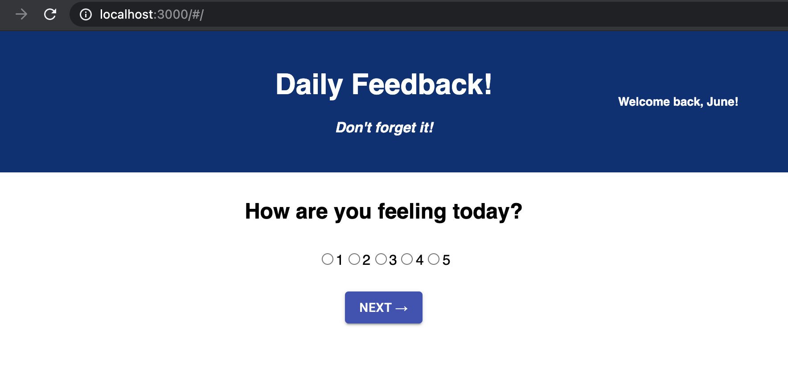
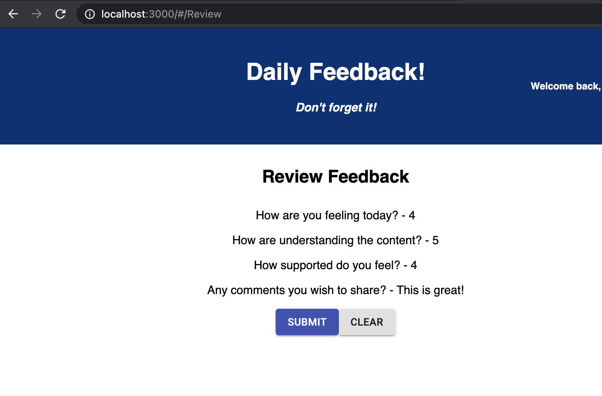
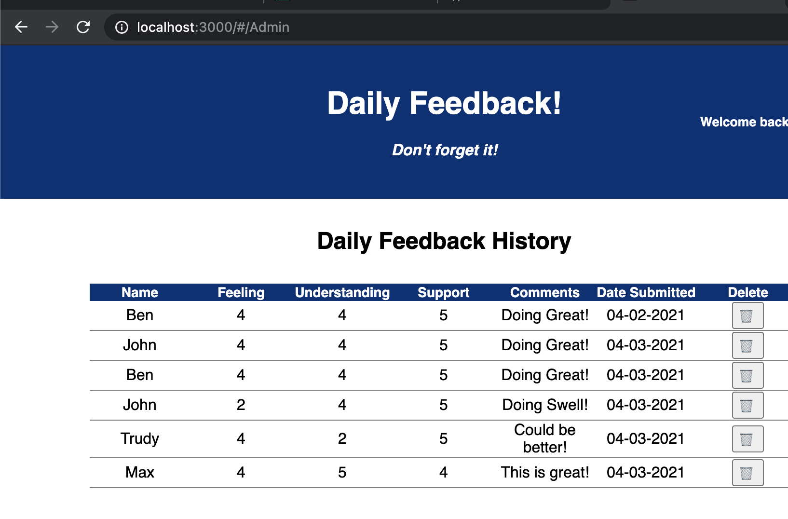

# Feedback Database

## Description

This project is a feedback application that allows a user to rate their day and the support they received. The data is entered by the user and the data is transferred through the app utilizing a store. The data is transferred to the SQL database utilizing axios calls from the REACT application. /Admin gives the site admin the ability to review the feedback provided.

## Technology
- Javascript
- React
- Redux
- Postgres
- Material UI
- HTML
- CSS
- Express

Contents:
- Feedback pages
- Dispatch calls to reducers
- Redux store
- Postgres data storage, retrieval and deletion
- CSS to style using Material-UI
- /Admin provices an admin screen for reviewing feedback